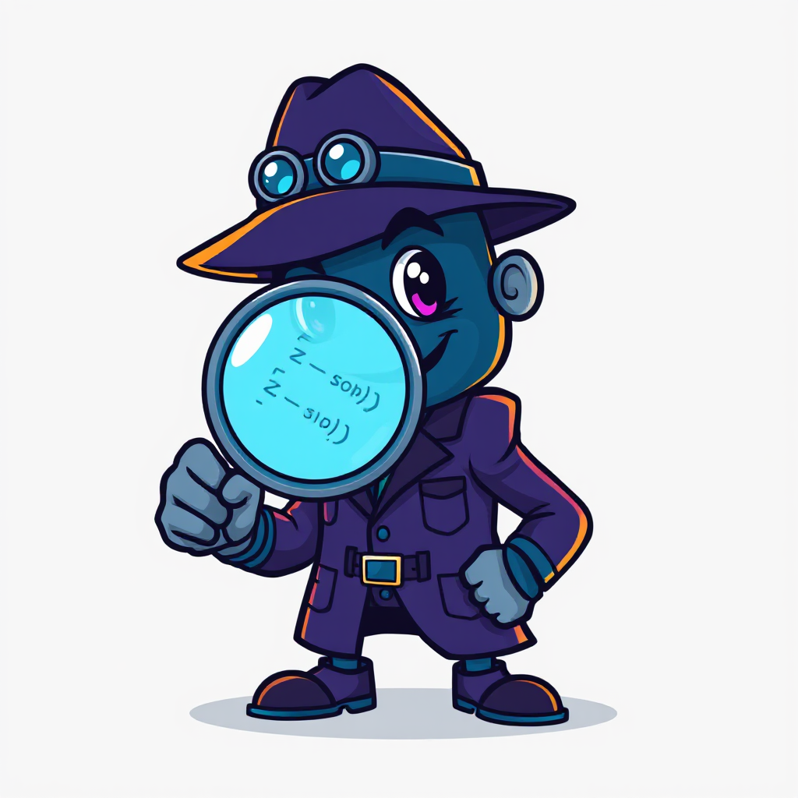

# Agent Cop

**Agent Cop** is a companion to coding agents — it lets you express code quality requirements as enforcable static analysis rules in a purpose-built DSL, stopping code slop before it lands. These rules run deterministically, e.g. in CI.

<br clear="left" />

## The Problem

Coding agents produce code at machine speed. Without deterministic enforcement, human engineers become bottlenecked reviewing everything for convention drift and design violations. Natural language instructions (copilot instructions, system prompts) are advisory — agents often ignore instructions as they get too complex and too large.

## The Solution

Use Agent Cop (cop.exe) to develop and execute static analysis rules. The workflow:

1. **Teach your coding agent about Agent Cop** — run `cop init` in your repo's root
2. **Create enforcable rules** — write rules in the DSL (manually or with your coding agent)
3. **Run cop.exe** — rule violations block PRs and feed back to your agent automatically

## Installation

Download `cop.exe` from the [releases](https://github.com/KrzysztofCwalina/cop/releases) page and add it to your PATH. 

## Quick Start

### 1. Initialize Agent Context

Run `cop init` in the root folder of your repo.

```bash
cop init
```

This generates instruction files (`.github/copilot-instructions.md`, `.github/skills/cop/SKILL.md`, `AGENTS.md`) that teach **GitHub Copilot** how to write cop rules. Commit these to your repo.

<sub>**Not on your `PATH`?** If you run cop through a tool manager like [mise](https://mise.jdx.dev) (so your toolchain stays version-locked), run `cop init --cop-cmd "mise exec -- cop"` so the generated files and hooks invoke cop the way you do instead of assuming bare `cop` on `PATH`.</sub>

<sub>**Using Claude Code?** Run `cop init --claude` to generate Claude Code instruction files (`.claude/commands/cop.md` — a `/cop` slash command) instead. Add `--ag` (shared hook, committed) or `--al` (local hook, per-user) to also install a Claude Code `Stop` hook that runs `cop cop-checks/main.cop -t . -om` after each task; `-om` skips analysis when no files changed. Both flags imply `--claude`, and existing settings are merged, not overwritten.</sub>

### 2. Create Rules

You can create rules manually or use your coding agent — not only for the app you're writing, but also for the rules themselves. Just ask:

> "Write a cop rule that flags any method longer than 50 statements"

> "Add a cop rule that there should not be empty folders in the repo"

> "Create a cop rule that all images should be in /img subfolder"

> "Create a cop rule that blocks dependencies from Foo.dll to Bar.dll"

The agent reads the instruction files setup using `cop init`, which tell it how to use cop.exe to write and execute rules. Here's what the generated rule for "types with too many methods" might look like:

```ruby
import csharp
import code

predicate tooManyMethods(Type) => Type.Methods.Count > 20

let violations = types():tooManyMethods
    :toWarning('Type {item.Name} has too many methods')

CHECK violations
```

### 3. Run the Rules

Ask the agent to run cop checks:

> "Run cop checks and fix any violations"

The agent will execute:

```bash
cop cop-checks/main.cop -t .
```

By default, cop analyzes the current working directory. Use `-t` to target a different folder:

```bash
cop cop-checks/main.cop -t src/
```

Exit code 1 if violations found, 0 if clean — suitable for CI. Agents see these errors and fix them automatically, just like compiler errors.

## Running Built-In Checks

Agent Cop ships with pre-built check packages for common rules. No `.cop` files needed:

```bash
cop run csharp-checks                     # C# naming, formatting, documentation
cop run python-checks                     # Python conventions
cop run javascript-checks                 # JS/TS conventions
cop run csharp-checks -t src/             # analyze a specific directory
```

Cop also supports **Rust**, **Go**, and **Java** — see the [Language Walkthroughs](docs/languages/) for getting started with any supported language.

Beyond source code, Cop ships native C# providers for common **config formats and scripts** — **YAML** (CI workflows, Kubernetes, compose), **Dockerfile**, **XML** (`.csproj`/`pom.xml`), **OpenAPI**, **Bash**, **PowerShell**, and **SQL** — so you can enforce rules on infrastructure and config too (e.g. pin GitHub Actions to a SHA, forbid `:latest` base images, flag `UPDATE`/`DELETE` without `WHERE`). See the [samples](docs/samples.md#formats-config--scripts).

You can see all pre-built packages by executing `cop package list`.
You can see details of packages, including usage samples, with `cop help <package_namwe>`.

## VS Code Extension

For syntax highlighting and IntelliSense completions in `.cop` files, install the VS Code extension:

```bash
cop vscode
```

## Resources

- [Samples](docs/samples.md) — all runnable examples in this repo
- [Package Reference](https://krzysztofcwalina.github.io/cop/reference.html) — types, predicates, and checks
- [Language Reference](docs/language-reference.md) — full DSL syntax
- [CLI Reference](docs/cli-reference.md) — all commands and options
- [Static Analysis with Cop](docs/static-analysis.md) — writing source code checks
- [Language Walkthroughs](docs/languages/) — per-language guides ([C#](docs/languages/csharp.md), [Python](docs/languages/python.md), [JavaScript](docs/languages/javascript.md), [Rust](docs/languages/rust.md), [Go](docs/languages/go.md), [Java](docs/languages/java.md))
- [Testing Cop Rules](docs/testing.md) — writing and running tests for your `.cop` programs
- [Extensibility](docs/extensibility.md) — writing providers and wrapping external tools
- [Packaging](docs/packaging.md) — creating, publishing, and restoring packages
- [Working with the REPL](docs/repl.md) — interactive development and prototyping
- [CodeQL Integration](docs/codeql.md) — using cop with CodeQL
- [Language Design](docs/language-design.md) — philosophy and design decisions
- [Language Grammar](docs/cop-grammar.md) — formal EBNF grammar specification
- [Why Agent Cop](docs/why-agent-cop.md) — product strategy and rationale
