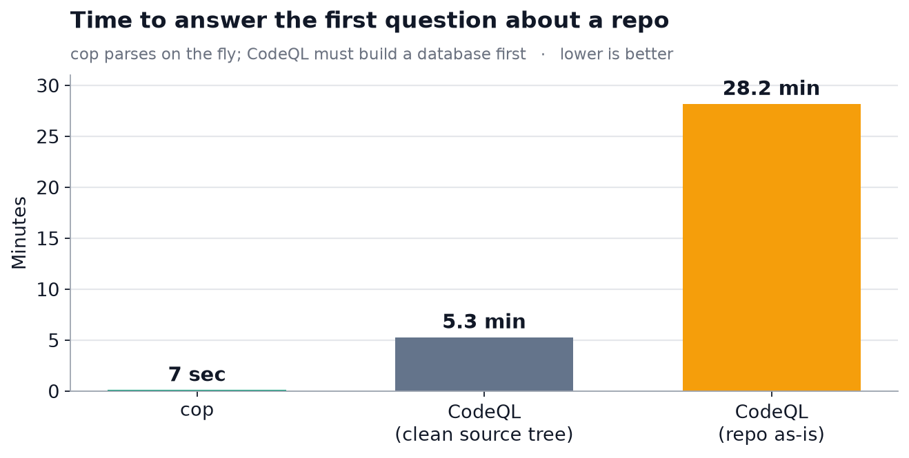
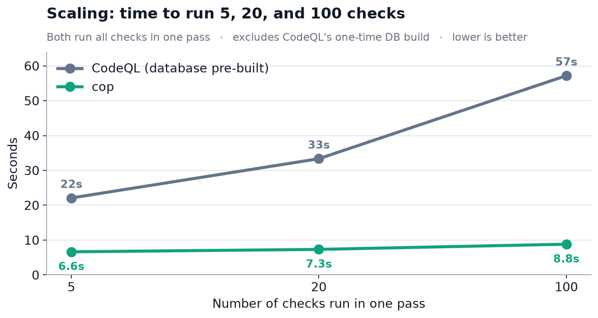
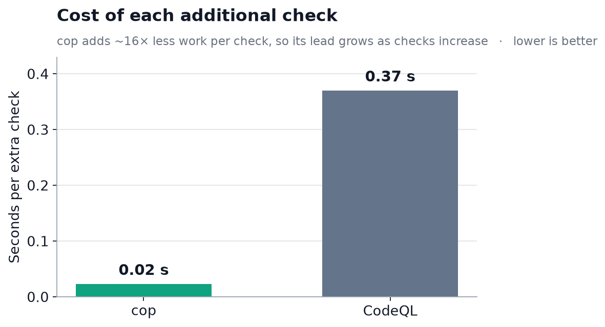

# cop vs CodeQL — Performance Summary

*How fast can each tool answer questions about a codebase?*
Benchmarked on a real .NET application (**289 C# files, ~47K lines**), June 2026.

---

> ## Bottom line
> **For the ad-hoc, structural code questions an agent asks, `cop` is 40–230× faster end-to-end
> than CodeQL — and the gap widens as you add more checks.**
> CodeQL must build a database (4.6–27.5 minutes) before it can answer anything; `cop` reads the
> source directly and answers in seconds with zero setup.

---

## 1. Time to the first answer

An agent (or engineer) pointed at a fresh repository gets an answer in **7 seconds** with `cop`.
CodeQL first has to build an analysis database — **5 to 28 minutes** — before any question can run.

| | Setup required | First answer | vs cop |
|---|---|---|---|
| **cop** | none | **~7 sec** | — |
| **CodeQL** (clean source tree) | 4.6 min DB build | ~5.3 min | **~44× slower** |
| **CodeQL** (repo as-is) | 27.5 min DB build | ~28.2 min | **~230× slower** |

---

## 2. Scaling to many checks

A natural question: *"CodeQL builds its database once, so doesn't it win when you run lots of
checks?"* **No.** `cop` also reads the code once per run and then evaluates every check in that
single pass — and each additional check costs it far less. Running **100 checks**, `cop` finishes
in **8.8 s**; CodeQL takes **57 s** (and that still ignores its multi-minute database build).

| Checks in one pass | cop | CodeQL¹ | cop advantage |
|---:|---:|---:|---:|
| 5 | **6.6 s** | 22.1 s | 3.3× |
| 20 | **7.3 s** | 33.4 s | 4.6× |
| 100 | **8.8 s** | 57.2 s | 6.5× |

¹ *CodeQL with its database already built and queries already compiled — its best case.*

Going from 5 → 100 checks added just **+2.2 s** for `cop` but **+35 s** for CodeQL.

---

## 3. Why it scales: cost per extra check

Each additional check costs `cop` about **0.02 s** versus **0.37 s** for CodeQL — **~16× less**.
Because `cop` starts lower *and* grows slower, its lead never stops widening. There is no point
at which CodeQL catches up.

---

## What this means for us

- **Agent-speed feedback.** `cop` returns answers in the seconds-range an interactive agent needs;
  CodeQL's minutes-long database build is a non-starter for ad-hoc, in-the-loop questions.
- **Zero setup, zero configuration.** `cop` reads source directly and ignores build output folders
  automatically. CodeQL needed careful setup — pointing it at the repo "as-is" was **6× slower**
  *and* produced a wrong result until the build artifacts were excluded.
- **Scales with check volume**, the direction teams actually grow.

## Scope & fairness (for the technical reader)

- This measures **fast, structural questions** (call sites, type shapes, simple patterns) — the
  bulk of what an agent asks. On these, both tools find essentially the **same results**; a
  properly-built CodeQL database was even marginally more accurate. **This is a speed comparison,
  not a correctness one.**
- CodeQL's heavyweight database exists to power **deep whole-program security analysis**
  (dataflow / taint tracking) that `cop` does not attempt. For that job its cost is justified —
  it's simply the wrong tool for quick, interactive questions.
- Every CodeQL number above **excludes** its one-time database build, giving CodeQL the benefit of
  the doubt. Measured with `cop 2026.6.18.3` and CodeQL CLI `2.25.6` (`--build-mode=none`).
  Full methodology, raw timings, and reproduction steps are in
  [`detailed-report.md`](detailed-report.md).
